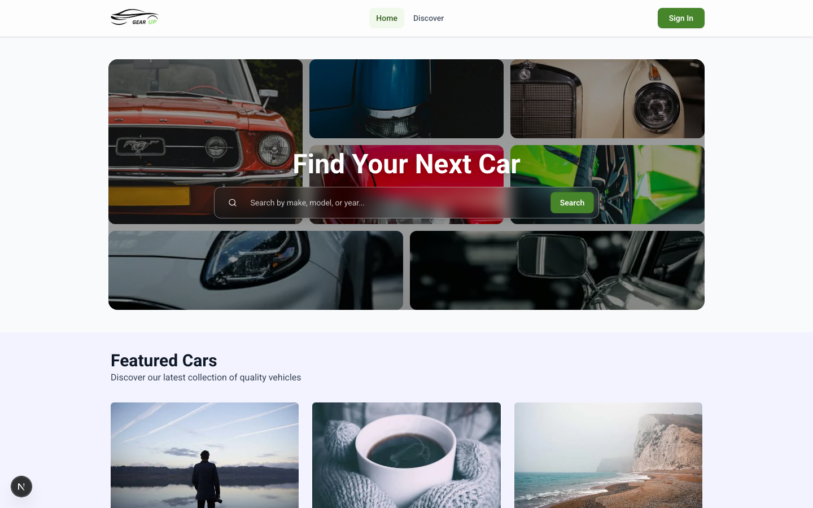
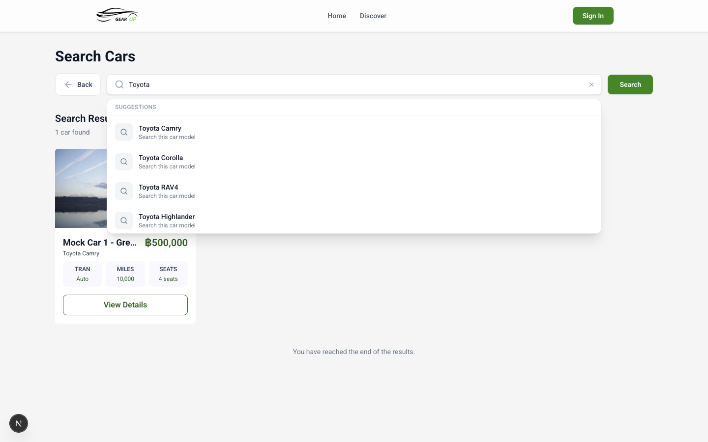
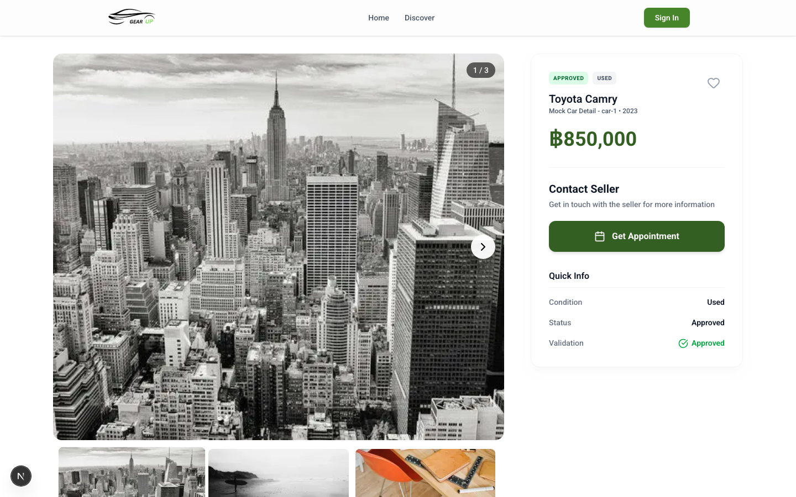
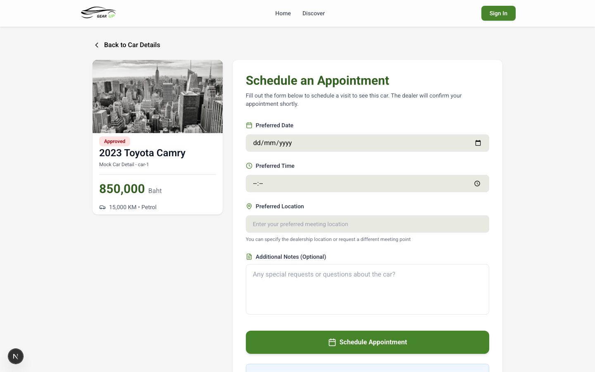
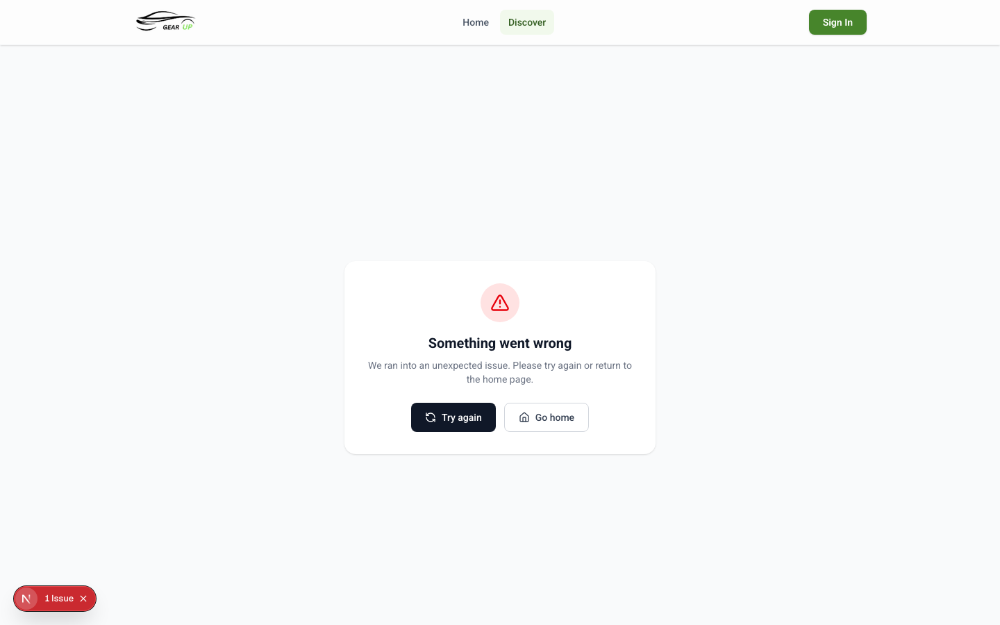
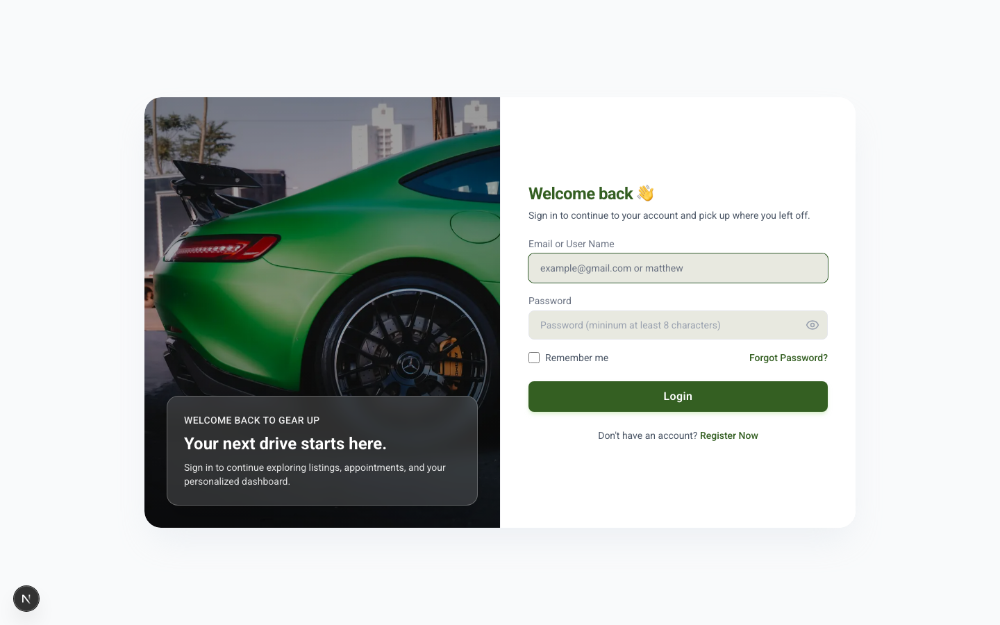
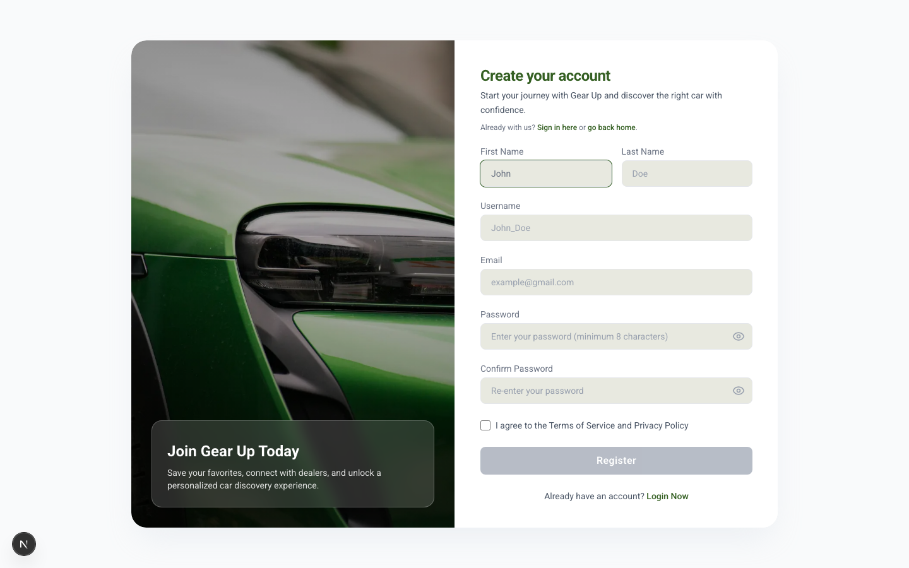
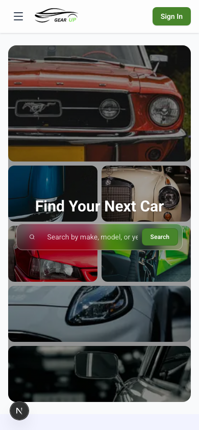

# Gear Up — Vehicle Marketplace Frontend

Gear Up is a production-style vehicle marketplace frontend built with **Next.js (App Router)**, **TypeScript**, **Tailwind CSS**, **TanStack React Query**, **Axios**, and **SignalR**.  
The platform connects car buyers, dealers, and administrators through car listings, appointment booking, KYC verification, community posts, notifications, and role-based dashboards.

> This repository focuses on the frontend application. The backend API is expected to run separately.

---

## Table of Contents

- [Overview](#overview)
- [Getting Started](#getting-started)
- [My Role](#my-role)
- [Key Features](#key-features)
- [Tech Stack](#tech-stack)
- [Architecture Overview](#architecture-overview)
- [Authentication & Authorization](#authentication--authorization)
- [Project Structure](#project-structure)
- [Testing](#testing)
- [Current Improvements](#current-improvements)
- [Future Improvements](#future-improvements)

---

## Overview

Gear Up is a full-featured vehicle marketplace frontend designed for three main user roles:

- **Users** can browse cars, view car details, book appointments, interact with posts, and manage their profile.
- **Dealers** can manage their vehicle inventory, handle appointments, complete KYC verification, and communicate with users.
- **Admins** can manage platform data, review dealer KYC submissions, and monitor listings.

The application uses a feature-based architecture with reusable UI components, typed API responses, protected routes, real-time communication, and test coverage for dashboard-related components.

---

## Getting Started

This project is a frontend-only app that expects a separate backend API.

Install dependencies:

```bash
npm install
```

Run the dev server:

```bash
npm run dev
```

Other useful commands:

```bash
npm run typecheck
npm run lint
npm run build
npm run start
npm run test
npm run test:e2e
```

## My Role

I worked as the **frontend developer** responsible for:

- Building the frontend architecture with Next.js App Router and TypeScript
- Creating role-based dashboards for users, dealers, and admins
- Integrating protected backend APIs
- Implementing authentication flows with secure cookie-based sessions
- Building dealer inventory and appointment management interfaces
- Integrating SignalR for real-time updates
- Improving UI performance for image-heavy and data-heavy pages
- Writing unit and integration tests with Jest and React Testing Library
- Creating reusable UI components, hooks, and utility functions

---

## Key Features

### Authentication & Session Management

- Login, registration, password reset, and email verification flows
- Secure token handling with httpOnly cookies
- Access token and refresh token flow
- Protected routes based on authentication state
- Role-based redirects for Admin, Dealer, and User accounts
- App-level providers for shared auth/session state

### Role-Based Dashboards

- Admin dashboard for platform management
- Dealer dashboard for vehicle inventory and appointment tracking
- User profile and account management pages
- Dashboard statistics, filters, empty states, and responsive layouts

### Vehicle Marketplace

- Car search and listing pages
- Car detail pages
- Dealer car management
- Status-based filtering for vehicle listings
- Image support through remote image configuration

### Appointment System

- Appointment booking flow
- Dealer-side appointment management
- Appointment status handling
- User-friendly empty states and dashboard summaries

### KYC Verification

- Dealer KYC submission flow
- Admin KYC review interface
- KYC filtering and status-based dashboard views

### Community & Notifications

- Community post discovery
- Comments, likes, and user interactions
- Notification and messaging support

### Testing

- Unit and integration tests with Jest and React Testing Library (220+ tests)
- E2E tests with Playwright for critical user flows (43+ tests)
- Page Object Model pattern for maintainable E2E selectors
- Mock backend server for isolated, repeatable E2E test runs
- CI pipeline with automated Jest and Playwright test execution

---

## Tech Stack

| Category       | Technology                                        |
| -------------- | ------------------------------------------------- |
| Framework      | Next.js (App Router)                              |
| Language       | TypeScript                                        |
| UI Library     | React                                             |
| Styling        | Tailwind CSS                                      |
| Server State   | TanStack React Query                              |
| Realtime       | SignalR (@microsoft/signalr)                      |
| HTTP Client    | Axios                                             |
| Validation     | Zod                                               |
| Animation      | Framer Motion                                     |
| Icons          | Lucide React                                      |
| Virtualization | @tanstack/react-virtual                           |
| Utilities      | clsx, date-fns                                    |
| Testing        | Jest, React Testing Library, Jest DOM, User Event, Playwright |
| Code Quality   | ESLint, Prettier                                  |

---

## Architecture Overview

```txt
Browser
  │
  ├─► Next.js App Router
  │     │
  │     ├─► Server Components
  │     ├─► Client Components
  │     ├─► Route Handlers
  │     └─► Protected Pages
  │
  ├─► Authentication Layer
  │     │
  │     ├─► Route handlers + auth helpers
  │     ├─► httpOnly cookies
  │     ├─► access_token
  │     └─► refresh_token
  │
  ├─► API Layer
  │     │
  │     ├─► Axios helpers
  │     ├─► Route Handler proxies
  │     └─► typed API responses
  │
  ├─► State/Data Layer
  │     │
  │     ├─► React Query
  │     └─► custom hooks
  │
  └─► Gear Up Backend API
```

## Authentication & Authorization

Gear Up uses a secure cookie-based authentication approach with role-based access control.

### Main Auth Flow

```txt
User submits login form
  ↓
Frontend sends credentials to the authentication API
  ↓
Backend validates credentials
  ↓
Backend returns access token and refresh token
  ↓
Frontend stores tokens in secure httpOnly cookies
  ↓
User is redirected based on role
```

## Project Structure

```txt
src/
├── app/
│   ├── api/                  # Route handlers and API proxy routes
│   ├── auth/                 # Login, register, reset, and verification flows
│   ├── features/             # Feature modules (auth, car, post, messaging, etc.)
│   ├── shared/               # Shared UI, hooks, types, providers, utilities
│   ├── layout.tsx            # Root layout
│   └── page.tsx              # Home page
│
├── proxy.ts                  # API proxy/token helper
```

## Testing

This project uses **Jest + React Testing Library** for unit/integration tests and **Playwright** for end-to-end tests.

### Unit & Integration Tests

Run all Jest tests:

```bash
npm test
npm run test:watch
npm test -- --coverage
```

Unit tests cover auth components, shared utilities, dealer dashboard components, and UI interactions. Tests are co-located with their components.

### E2E Tests

Run all Playwright tests:

```bash
npm run test:e2e
npm run test:e2e:ui          # interactive debug mode
npx playwright show-report   # view HTML report
```

E2E tests cover auth flows (sign up, sign in, reset password, email verification), car browsing/search/detail, and appointment booking — 43 tests across 8 spec files. A mock backend server provides controlled API responses for fast, repeatable runs. See [TESTING.md](./TESTING.md) for full details.

### Testing Tools

| Tool                  | Purpose                                      |
| --------------------- | -------------------------------------------- |
| Jest                  | Test runner and assertions                   |
| React Testing Library | Component rendering and user-focused testing |
| Jest DOM              | Custom DOM matchers                          |
| User Event            | Realistic user interaction testing           |
| Playwright            | End-to-end browser testing                   |

---

## Current Improvements

Recent updates reflected in the codebase include:

- E2E test suite with Playwright (43+ tests) and a mock backend server
- Production-safe error handling — server errors are mapped to generic user-facing messages
- Skeleton loading states for home page, car detail, and search pages
- Accessibility pass — `aria-label` on all icon-only buttons (10 across 8 components)
- Drag-and-drop file upload for car images
- Dealer public profile page with listings grid
- Styled confirmation modals replacing native `window.confirm()` dialogs
- CarGrid refactored to client-side data fetching with React Query
- AxiosClient hardened — concurrent refresh dedup, cookie mutation safety, FormData auto-detection
- TypeScript type checking (`npm run typecheck`) in CI pipeline
- Error boundaries on all routes — contextual recovery UI for auth, cars, posts, messages, and profile pages
- SEO metadata — dynamic Open Graph images for car listings, proper `metadataBase`, `robots`, and canonical URLs
- Integration tests for appointment hooks and KYC registration context (42 new tests)

---

## Screenshots

### Home Page



### Car Search



### Car Detail



### Appointment Booking



### Community Posts



### Login Page



### Register Page



### Mobile View



---

## What This Project Demonstrates

This project demonstrates my ability to build a real-world frontend application with:

- Modern Next.js App Router architecture
- Type-safe React development with TypeScript
- Secure authentication handling
- Role-based access control
- Complex dashboard UI development
- API integration with backend services
- Real-time frontend communication with SignalR
- Performance-aware list rendering
- Form validation and user feedback
- Component and integration testing
- Feature-based project organization
- Reusable UI component design
- Responsive layouts for multiple screen sizes
- Production-safe error handling with sanitized user-facing messages
- Skeleton loading states for key pages
- Accessibility (aria-labels on icon-only buttons)
- CI/CD pipeline with lint, type-check, test, build, and E2E stages
- Route-level error boundaries with contextual recovery UI
- SEO metadata with dynamic Open Graph images and canonical URLs

---

## Future Improvements

Planned improvements:

- Add better demo data for portfolio and recruiter review
- Improve image fallback handling (add `images.qualities` defaults)
- Improve mobile dashboard navigation
- Improve reusable form components
- Add stronger API response validation with Zod
- Add more documentation for authentication and route protection
- Add Storybook for reusable UI components
- Add performance monitoring for image-heavy pages
- Replace remaining `alert()` calls in admin panel with styled modals/toasts
